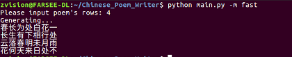
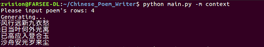
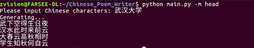

# Chinese poem writer

### Introduction
We built a Chinese poems writer based on [Temporal Convolutional Networks (TCN)](https://arxiv.org/abs/1803.01271). This paper recently indicates that a simple TCN architecture outperforms RNNs across a diverse range of tasks and datasets, while demonstrating longer effective memory.
Therefore, we train this Chinese poems writer using TCN.

### Dependencies
```
Python3.x(Tested with 3.5)
PyTorch(Tested with 0.4.0)
```

### Installation
The code was tested with Python 3.5. To use this code, please do:


0. Clone the repo:
    ```Shell
    git https://github.com/jfzhang95/Chinese_Poem_Writer
    cd Chinese_Poem_Writer
    ```
1. To try the demo code, please run:
    ```Shell
    python main.py -m fast
    ```
### Training
To train this Chinese poems writer, you should run:

    python train.py

For more details, please see in [train.py](https://github.com/jfzhang95/Chinese_Poem_Writer/blob/master/train.py).

### Usage
We built three poem generator mode:

0. fast - it can generates each word just based on the last word.
1. context - it can generate each word based on entire previous context.
2. head - it can generate Acrostic using user inputs.

To change generator mode, you should change "fast" to "context" or "head" behind:

    python main.py -m fast

### Results

    python main.py -m fast



    python main.py -m context



    python main.py -m head



Upload generated poem into [diyiziti](http://www.diyiziti.com/), we can get more artistic result!


### TODO

- [x] Basic model and function
- [ ] Write a script to upload generated poem automatically
- [ ] Training our model with more and better data


We thank the authors of [pytorch-tcn](https://github.com/locuslab/TCN) for making their PyTorch implementation of TCN available!
